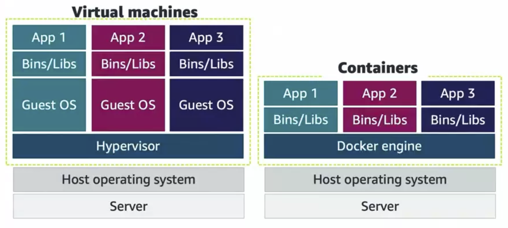

Most applications today are either built in a microservice architecture or with containers. This is a brief introduction to containers with Docker and Kubernetes.

<hr>

## What are Containers?

A **container** is a standard package of software that bundles an application, code, dependencies, libraries, and configuration files into a single package or executable. For the sake of this introduction, we will focus on **Docker** containers. **Docker** is an open-source platform to develop, ship, and run containerized applications.

Docker containers rely on Linux kernel features like **cgroups** and **namespaces** to isolate processes and resources. **Namespaces** provides a view of the operating system that is isolated to your container. By view, we mean that the container has its own process ID (PID) space, network interfaces, and filesystem. **Cgroups** are used to limit the resources that a container can use, such as CPU, memory, and disk I/O. Docker containers use these features, so we can run multiple containers without having to do the managing and isolation ourselves.

### Containers vs Virtual Machines

Containers and virtual machines (VMs) are similar, both providing an isolated environment to run applications. However, containers do not require a hypervisor nor a guest operating system. Containers share the host operating system's kernel. The **hypervisor** is a software layer that allows multiple operating systems to run on a single machine.



## Docker

Docker has three main components: **Docker Client**, **Docker Daemon**, and the **Image Registry**.

- **Docker Client**: The command-line interface (CLI) that allows users to interact with Docker. Users interact with Docker Daemon through the Docker Client.
- **Docker Daemon**: Creates and manages Docker images on your behalf. Installed on the host machine.
- **Image Registry**: A repository for Docker images.

A **Docker image** is a _read-only_ template that contains a set of instructions for creating a container. An image is a snapshot of a container. Docker images share layers, allowing for efficient use of disk space. A **Docker container** is a running instance of a Docker image. You can run multiple containers from the same image.

To get a Docker image, we need Docker Daemon to build the image from a `Dockerfile`. On Docker Client, we run `docker build` to build the image. Then, we use `docker run` to create a container from the image.

Docker images are built using a **Union File System**. A Union File System is a file system that operates by creating layers. Each layer is a set of files and directories. When you create a new image, Docker adds a new layer on top of the existing layers. This allows for efficient use of disk space. When you run a container, Docker creates a new read-write layer on top of the image layers. This read-write layer is unique to the container that allows the container to write to the filesystem.

### Working with Dockerfile

Below is an example of a `Dockerfile` that creates a node.js application.

```python
FROM node:gallium-alpine3.14 # tells Docker to use the node image from Docker Hub

WORKDIR /app # sets the working directory to /app
ENV NODE_ENV=production # sets the NODE_ENV environment variable to production

COPY app . # copies the app directory to the working directory
RUN npm install # installs the dependencies

CMD node server.js # runs the server.js file
EXPOSE 8080 # exposes port 8080
```

We can build this image by running `docker build -t my-node-app .` in the same directory as the `Dockerfile`. The `-t` flag tags the image with a name. The `.` tells Docker to look for the `Dockerfile` in the current directory.

Then, we can run the image with `docker run -p 4000:8080 my-node-app`. The `-p` flag maps port 8080 in the container to port 4000 on the host machine.

Other commands:

- `docker ps`: Lists running containers
- `docker image ls`: Lists images. This will include the node image we used in the `Dockerfile` above!
- `docker run -d my-node-app`: Runs the container in detached mode, meaning it runs in the background.
- `docker exec -it my-node-app ...`: Executes a command in a running container. The `-it` flag allows for interactive mode. For example, `docker exec -it my-node-app sh` will open a shell in the container.
  - Opening a shell allows us to run other commands such as `ls` (files), `ps -a` (processes), etc.
- `docker stop my-node-app`: Stops the container.
- `docker rm my-node-app`: Removes the container.
- `docker run -e NODE_ENV=development my-node-app`: Sets the `NODE_ENV` environment variable to development.
- `docker run -v ... my-node-app`: Mounts a volume to the container. For example, `docker run -v $(pwd):/app my-node-app` mounts the current directory to the `/app` directory in the container. This allows us to make changes to the code on the host machine and see the changes reflected in the container.

Other contents of the `Dockerfile`:

- `FROM`: Defines the base image. All the instructions that follow are run in a container launched from the base image.
- `WORKDIR`: Sets the working directory for the subsequence instructions.
- `ENV`: Sets environment variables.
- `COPY`: Copies files and directories into the container image.
- `RUN`: Runs commands in the new container. This instruction commits a new layer on top of the present layer.
- `CMD`: Sets the default command to run when the container is launched.
- `EXPOSE`: Is used to document the containers that the port exposes.

### Multi-Container Applications

**Docker Compose** is a tool for defining and running multi-container Docker applications. We use a `YAML` file to configure the application's services. Below is an example of a `docker-compose.yml` file that defines two services: a web service and a database service.

```yaml
version: "3.8" # version of the Compose file format

services:
  web: # our web service
    # build the image from the current directory
    # this means there must be a Dockerfile in the current directory
    build: .
    ports:
      - "4000:8080" # map port 8080 in the container to port 4000 on the host machine
    volumes:
      - .:/app # mount the current directory to the /app directory in the container
    environment:
      NODE_ENV: development # set the NODE_ENV environment variable to development
    depends_on:
      - db # depends on the db service

  db: # our database service
    image: postgres:alpine # use the postgres image from Docker Hub
    environment:
      POSTGRES_USER: user
      POSTGRES_PASSWORD: password
```

Docker compose has the following commands:

- `docker-compose build`: Builds the images of the services.
- `docker-compose up (-d)`: Creates and starts the services. The `-d` flag runs the services in detached mode.
- `docker-compose down`: Stops and removes the services.
- `docker-compose ps`: Lists the status of each container.
- `docker-compose exec ...`: Executes a command in a running container. For example, `docker-compose exec web sh` will open a shell in the web service container.

## Kubernetes

**Kubernetes** is a portable, extensible, open-source platform for managing containerized workloads and services. Kubernetes provides a framework for automating deployment, scaling, and operations of application containers across clusters of hosts.

### Kubernetes Architecture and Objects

Kubernetes objects can be broken down into three categories:

- A _namespace_ isolates groups of resources in a Kubernetes cluster.
- A _pod_ is the smallest Kubernetes object that represents a container on a cluster.
- A _deployment_ is a declarative template for pods.

#### More Resources

- [Docker Documentation](https://docs.docker.com/)
- [Kubernetes Documentation](https://kubernetes.io/)
