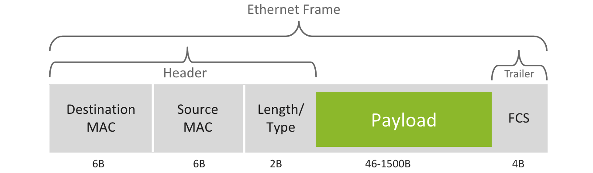

This is a breakdown of how ethernet works, its standards, MTU, and MAC addresses. Notes and visuals derived from this [introduction to networking course](https://www.coursera.org/learn/introduction-to-networking-nvidia) from Nvidia. For more on how networks themselves work, see my notes on [networks](/writing/networks).

## What is Ethernet?

**Ethernet** operates in the data link layer and the physical layer of the OSI model. The **data link layer** defines functional and procedural means to transfer data between network nodes. The data link layer also detects errors that can occur in the physical layer. The **physical layer** defines electrical (optical) properties and transfer speed of physical connection between network nodes. Ethernet is the predominant LAN technology, giving high speed performance for a broad range of applications.

### Ethernet Addressing

Nodes send Ethernet frames to each other. Ethernet nodes are identified with a unique address known as a **MAC (Media Access Control) address**. The Ethernet frame header contains source and destination MAC addresses in their header. A **network interface card (NIC)** is a hardware component that connects nodes to the network. The NIC allows devices to communicate over a network, either by cables or wirelessly. The NIC is both in the physical layer and the data link layer. The NIC provides physical access to the physical medium and provides an addressing system using MAC addresses.

### MAC Addresses

The MAC address is the unique identifier assigned to a network interface for use as a network address. A MAC address is burned on the network adapter's hardware by the vendor. MAC addresses are 48-bit. The left half represents the OUI (Organizationally Unique Identifier) and the right half represents the serial number assigned by the vendor. The MAC address is listed as 12 unique hexidecimal digits.

### Ethernet Frame Structure

An Ethernet frame includes the following fields:

- **Payload**: upper layer protocol data (e.g. IPv4/6 packet)
- **Destination MAC Address**: specifies the node for which the frame is intended
- **Source MAC Address**: specifies the node sending the frame
- **Length/Type**: indicates the upper layer protocol (EtherType)
- **FCS**: trailer used for the detection of corrupt frames

> FCS stands for Frame Check Sequence

**Maximum Trasmit Unit (MTU)** defines the maximum payload size that can be carried by a single Ethernet frame. Frames with more than 1500 bytes payload are considered "jumbo frames." Ethernet frame size is 64-1518 bytes.

### Ethernet Switches

An **Ethernet switch** connects multiple Ethernet nodes. Ethernet nodes may have one or more Ethernet switches connecting between them. An Ethernet switch forwards frames from source to destination. They utilize a **MAC Address Table**, a database of known MAC addresses mapped to switch (exit) ports. The MAC Address Table is populated by the switch by learning the source MAC address of incoming frames. They are dynamically maintained, and entries are removed after a certain time period.

A **unicast frame** is a frame sent from one node to another. Frames with destination MAC addresses not found in the MAC Address Table are known as **unknown unicast frames**. The switch floods the unknown unicast frame, sending it to all other ports besides the incoming port.

A **broadcast frame** represents all nodes on a network. The address is represented with a destination MAC address with all bits set to 1 (i.e. `FF:...:FF` in hex). There are also **multi-cast frames**, which allow one to specify multiple destinations, although are generally flooded to all ports.

### Layer 3 Switches

A **Layer 3 switch** is a switch that operates at the network layer (layer 3). Traditional switches just operate at the data link layer (layer 2). Layer 3 switches can make routing decisions based on IP addresses, therefore giving the capability to act as both a switch and a router.

### More Resources

- [Networks](/writing/networks)
- [TCP/IP Protocols](/writing/tcp-ip)
- [Coursera Course on Networks](https://www.coursera.org/learn/introduction-to-networking-nvidia)
