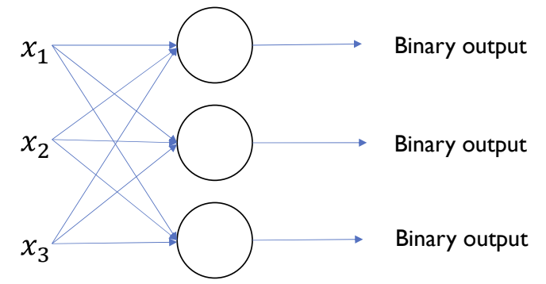
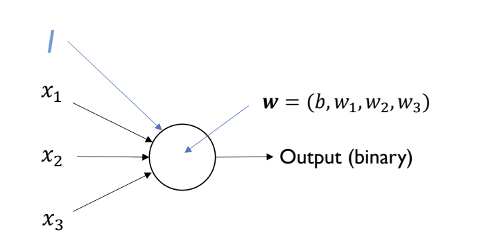
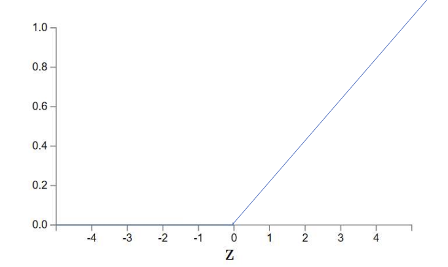

This is a brief introduction to neural networks. We will start below by comparing the traditional machine learning pipeline to the neural network pipeline. We will then discuss perceptrons, multiple perceptrons, bias implementation, composition, non-linear activation, and convolution neural networks.

Here is a common machine learning pipeline. Each bullet lists the manual steps that must be taken to build a classifier. The goal of neural networks is to automate these steps.

1. Image formation - Manually capturing photos for database

2. Filtering - Hand designed gradients and transformation kernels

3. Feature points - Hand designed feature descriptors

4. Dictionary building - Hand designed quantization and compression

5. Classifier - _Not_ hand designed, learned by the model

**Goal of Neural Networks**: To build a classifier to automatically learn [2-4]

**Compositionality**: For images, an image is made up of parts, and putting these parts together creates a representation.

## Perceptrons

Neural networks are based on biological neural nets.

For linear classifiers, we formulate a binary output (classifier) based on a vector of weights $w$ and a bias $b$

$output = \begin{cases}
  0  & \text{if } w \cdot x + b \leq 0 \\
  1 & \text{if } w \cdot x + b > 0
\end{cases}$

**Example**: For a $28\times 28$ pixel image, we can vectorize the image into a $1 \times 784$ matrix. The dimensions of our variables will be:

<blockquote>

$x = 1 \times 784$

$w = x^T = 784 \times 1$

$output = xw + b = (1 \times 784) (784 \times 1) + b = (1 \times 1) + b=$ (scalar)

</blockquote>

## Multiple Perceptrons

For a multi-class classification problem, we can add more perceptrons as above. We then pass in each input value to each perceptron.

**Example**: For a $28\times 28$ pixel image, we can vectorize the image into a $1 \times 784$ matrix. **But now we have 10 classes.** The dimensions of our variables will be:

<blockquote>

$x = 1 \times 784$

$W = x^T = 784 \times 10$

$b = 1 \times 10$

$output = xW + b = (1 \times 784) (784 \times 1) + 1 \times 10 = 1 \times 10 + 1 \times 10=$ (vector)

</blockquote>

## Bias implementation

To implement bias, we must add a dimension to each input vector. This input value should be consistent between perceptrons and input vectors, usually just a $1$ at the start or end of a vector. This increased dimensionality, adds a weight to our perceptron, and this extra $w_i$ is the bias, $b$ of the perceptron.

## Composition

The goal of composition is to attempt to represent complex functions as a composition of smaller functions. Compositional allows for hierarchical knowledge.

The output vector per perception of one layer must have equal dimension of the input vector to the next perceptron layer.

This is also known as _multi-layer perceptron_. The perceptron layers between the initial input and final output are known as _hidden layers_. Usually, deeper composition with more _hidden layers_ gives better performance, and these deeper compositions are known as _deep learning_.

## Non-linear activation

Because our perceptron layers are linear functions, we could reduce these layers to a singular function, which isn't very helpful. In other works, a multi-layer perceptron neural network (NN) could be simplified to a single-layer perceptron NN if the layers are linear. A non-linear activation function introduces non-linearity to the neural networks.

$$
g(x) = f(h(x))
$$

We can introduce a non-linear activation function to transform our features.

Example non-linear activation function (Sigmoid):

$$
\sigma(z) = \frac{1}{1 + e^{-z}}
$$

### Rectified Linear Unit (ReLU)

A popular non-linear activation function:

$$
f(x) = max(0, x)
$$

ReLU layers allow for locally linear mapping and solves the vanishing gradients issue. The vanishing gradients issue occurs when gradients dimish while training a deep learing model, and is often dependent on the activation function.

[Here is a fun visual for activation functions and hidden layers.](https://playground.tensorflow.org/)

## Convolution Neural Networks (CNNs)

It is too computationally expensive to train neural networks on vectorized images. Instead we have to use _convolution_.

_Convolution_ works by sliding a kernel over an image. For each neuron, it learns its own filter (kernel) and convolve it with the image. The result of this convolution process is a feature map.

$$
h[m,n] = \sum f[k,l] I[m +k, n+l]
$$

This is known as a _convolution neural network_. We decide how many filters and layers to train.

This original convolution function $h[m,n]$ is transformed to

$$
h_j^n = max(0, \sum_{k=1}^K h_k^{n-1} * w_{kj}^n)
$$

where $n=$ layer number, $K=$ kernel size, $j=$ # of channels (input) or filters (depth)

### Learn More

If you are interested in learning more about neural networks, I recommend reading my article on [neural network layers](/writing/nn-layers)!

### Sources

- [Computer Vision @ Brown](https://browncsci1430.github.io/)
