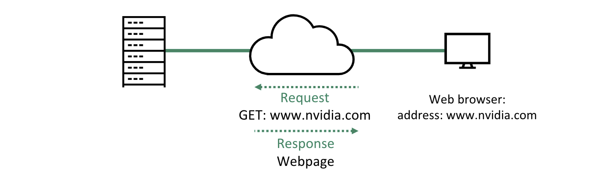
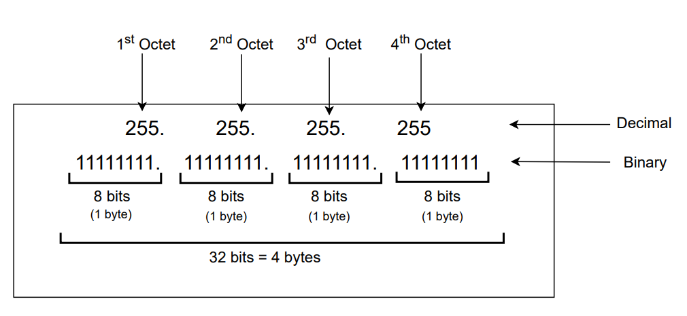
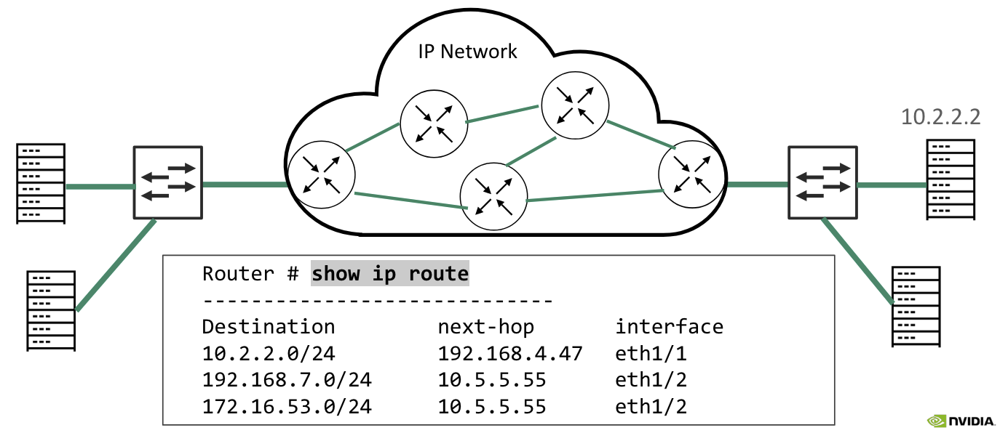

This is a breakdown of different protocols in the TCP/IP Protocol Suite. The TCP/IP Protocol Suite is a set of protocols that are used to communicate over the internet. It is the most widely used protocol suite in the world, and is named after the two most important protocols, TCP (Transmission Control Protocol) and IP (Internet Protocol). Notes and visuals derived from this [introduction to networking course](https://www.coursera.org/learn/introduction-to-networking-nvidia) from Nvidia. For more on how networks themselves work, see my notes on [networks](/writing/networks).

## Application Layer Protocols

It's important to remember that the goal a network is to transfer information. For two applications to exchange information over a network, they most implement the same protocol. An example of this is web browsers requesting a web page from a web server. On one end, the application is the web browser. On the other end, the application is the web server.

When a user puts a URL address in the address bar of a web browser, the web browser converts the request to a format the web server will be able to understand. The web server will respond with a format that the browser can display in text or links.

Whenever an application wants to communicate with another remote application, it hands over data to the transport layer.

### HTTP

HTTP is the **Hyper Text Transfer Protocol**. HTTP allows the exchange of text and hyperlinks. HTTPS is the secure variant of HTTP. HTTP functions as a request-response protocol in the client-server model. The client submits an HTTP request message to the server. The server will respond with resources (such as HTML files) and a response message including a completion status.

### FTP

FTP is the **File Transfer Protocol**. It is also an application layer protocol. Users can either connect anonymously to the server or sign in with a clear-text sign-in protocol, usually a username and password. FTPS is the secur variant of FTP, encrypting the content and protecting the username and password.

## Transport Layer Protocols

The next step is for the application layer protocol to ask for transport layer services. Transport layer protocols establish end-to-end logical communcation channels between applications. They facilitate the communication of hosts. They can provide a reliable connection and carry out error checking, flow control, and verification. Eventually it asks layer 3 (network layer) to carry information to the destination. TCP and UDP operate at the transport layer.

### TCP

TCP is the **Transmission Control Protocol**. TCP is a **connection-oriented** transfer protocol, meaning a connection is established between the peer entities _prior_ to tranmission. TCP uses sequence numbers and acknowledgements (know as **ACKs**) to recover damaged or lost data. TCP allows the receiver to govern the amount of data sent by the sender. Sequence numbers are also used to order segments and give ordered delivery.

Generally, applications that require _reliability_ use TCP as their transfer protocol layer. For applications that require fast and light-weight transportation, TCP is not be the best choice.

#### TCP Sessions

When two application processes wish to communicate over TCP:

1. A connection must be established
2. Data can now be transfered
   - TCP uses a **keep-alive** feature to manage connections
3. After data transmission is completed, the connection is terminated and all allocated resources are released.

#### Three-Way Handshake

TCP connections are established using the **three-way handshake** process:

1. Client sends a syncronization (**SYN**) message to the server. The goal of this message is to ask the server if it is open for connections.
2. The server must return an acknowledgement (**ACK**) message. SYN and ACK are flags in the TCP header, also known as **control bits**.
3. Client responds with its own ACK message.
4. Connection is now created and the client and server can communicate.

### UDP

UDP is the **User Datagram Protocol**. UDP allows applications to communicate with a minimum protocol overhead. For UDP, data is continuously sent, rather the recipient is ready for it or not. Unlike TCP, UDP is connectionless, meaning no session is established. UDP uses no ACKs, and therefore has no re-transmissions, flow control or re-delivery. On the other hand, UDP is much more resource efficient and uses less bandwidth.

> **Bandwith** is the maximum amount of bits that can be transmitted between two applications in a given time period. When we say UDP uses less bandwidth, it means it takes less bits to transfer the same information.

### Port Numbers

Both UDP and TCP use source and destination port numbers to identify specific processes or service within local and remote nodes. For example, the default port for HTTP is 80. A client may request an HTTP service and would therefore specify 80 as the destination port.

## Network (Internet) Layer Protocols

Now that our application layer message has passed through the transport layer, UDP or TCP, it is time to move onto the network (or internet) layer protocols, layer 3.

### IP

IP is the **internet protocol** and operates on the network layer. IP provides services to layer 4 protocols and asks layer 2 protocols to carry the IP packets. IP is a **best-effort** protocol and therefore does _not_ include mechanisms for reliability, flow-control, and sequencing.

Unlike UDP and TCP who communicate directly between applications, IP provides the functions necessary to deliver a packet from source to destination over an interconnected system of networks.

#### IPv4 Addressing

Today, IP has two main versions, IPv4 and IPv6. IPv6 is the newest version. An IP address is assigned to a network interface of node. IPv4 addresses are 32 bits (4 octets). Each octet is separated by a dot and shown as its decimal equivalent.

IP addresses have two parts:

- **Network Address**: identifies the network portion of the address
- **Host Address**: identifies a specific host within a network

All hosts in the _same_ subnet share the _same_ common subnet address. Every router interfact defines an IP subnet.

### IP Routers

**Routing** is the process of choosing the best path to reach the destination. This must be why there are so many [LeetCode Graphing Problems](https://leetcode.com/problems/number-of-operations-to-make-network-connected) on networking 🙂

A **router** is a computer that has been dedicated to the task of forwarding IP packets between networks. A router makes forwarding decisions based on its forwarding database, called a **routing table**. A routing table includes entries that map remote IP networks to `next-hop` routers that are identified by local interfaces. The router will forward the packet to the next-hop router, until the packet reaches the destination, _hop by hop_.

### More Resources

- [Networks](/writing/networks)
- [Ethernet](/writing/ethernet)
- [Coursera Course on Networks](https://www.coursera.org/learn/introduction-to-networking-nvidia)
